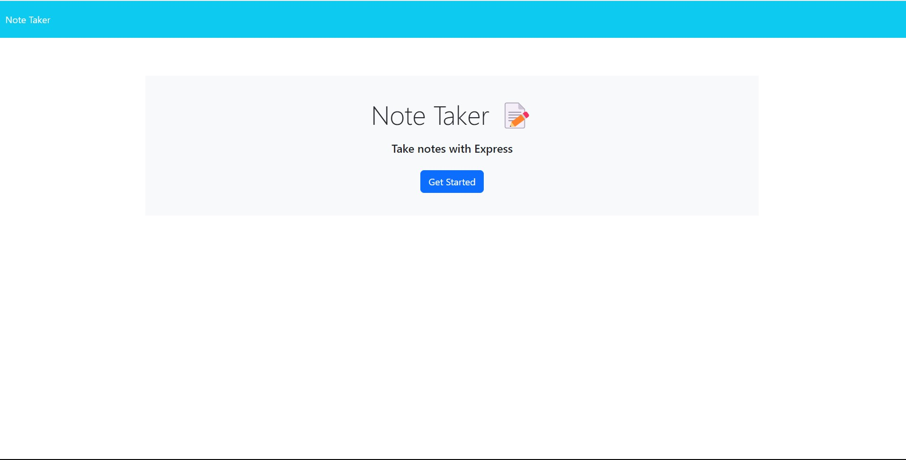

# Note Taker

## Description
A simple application to write, save, and delete notes. This application uses an Express.js back end and saves/retrieves note data from a JSON file.

The site can be accessed [here](https://secret-mesa-81373-68f8998a8913.herokuapp.com/notest).

## Features

- Write and save notes.
- View previously saved notes.
- Delete previously saved notes.

## Installation

1. Clone the repository to your local machine.
2. Navigate to the project directory in the terminal.
3. Run `npm install` to install all dependencies.
4. Run `node server.js` to start the server.
5. Open your browser and visit `http://localhost:3000` to access the application.

## Technologies Used

- JavaScript
- Node.js
- Express.js
